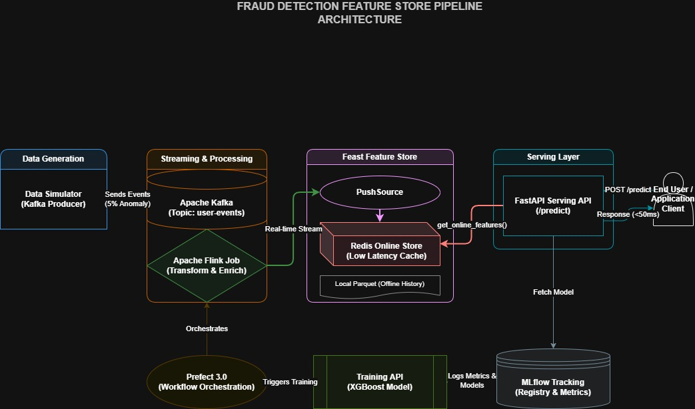

# Fraud Detection Feature Store Pipeline

A production-ready, end-to-end fraud detection system that simulates real-time user behavior, processes streaming data, engineers features in real-time, and serves low-latency fraud predictions. This project demonstrates a complete MLOps pipeline with data simulation, stream processing, feature engineering, model training, and serving.

## Architecture



```
┌──────────────────────────────────────────────────────────────┐
│                   FRAUD DETECTION PIPELINE                  │
└──────────────────────────────────────────────────────────────┘

Data Simulation (Kafka Producer)
         │ Generate user events (clicks, anomalies)
         ▼
    Kafka Topic
    user-events
         │ Buffer streaming data
         ▼
   Apache Flink Job
    Stream Processing
         │ Transform & enrich events
         ▼
   Feast PushSource
   Feature Engineering
         │ Real-time feature computation
         ▼
  Redis Online Store
   Feature Storage
         │ Low-latency lookup
         ▼
  FastAPI Serving Layer
  REST API Endpoint
         │ Query features + predict
         ▼
  Fraud Prediction API
  /predict endpoint
         │
         └─► MLflow Tracking (metrics, models)
         └─► Training API (model training)
         └─► Prefect Orchestration (workflow automation)
```

## Key Features

| Feature | Technology | Purpose |
|---------|-----------|---------|
| **Data Simulation** | Kafka Producer | Generate realistic user events with anomalies |
| **Stream Processing** | Apache Flink | Real-time event processing & transformations |
| **Feature Engineering** | Feast + Redis | Online feature store for low-latency retrieval |
| **REST API** | FastAPI | Serve fraud predictions with <50ms latency |
| **Model Training** | XGBoost + MLflow | Train models with experiment tracking |
| **Orchestration** | Prefect | Automate data pipeline execution |
| **Containerization** | Docker Compose | Production-ready multi-service deployment |
| **Code Quality** | Pre-commit Hooks | Automatic code formatting & linting |

## Tech Stack

| Component | Technology | Version |
|-----------|-----------|---------|
| Message Queue | Apache Kafka | 7.5.0 |
| Stream Processing | Apache Flink | 1.18.1 |
| Feature Store | Feast | 0.40.1 |
| Online Store | Redis | 7.0 |
| API Framework | FastAPI | Latest |
| ML Framework | XGBoost | 2.0+ |
| Experiment Tracking | MLflow | 2.10+ |
| Orchestration | Prefect | 3.0+ |
| Object Storage | MinIO | Latest |
| Language | Python | 3.10 |
| Containerization | Docker Compose | Latest |

## Project Structure

```
fraud-detection-feature-store/
│
├── feature_repo/                      # Feast feature definitions
│   ├── feature_store.yaml            # Feature store configuration
│   ├── features.py                   # Feature view definitions
│   └── data/
│       └── dummy_history.parquet     # Historical training data
│
├── infra/
│   ├── compute/
│   │   ├── flink/
│   │   │   ├── Dockerfile
│   │   │   └── flink_job.py          # Flink stream processing job
│   │   ├── data_simulator/
│   │   │   ├── Dockerfile
│   │   │   └── producer.py           # Kafka event producer
│   │   └── orchestration/
│   │       └── prefect/              # Workflow orchestration
│   ├── storage/
│   │   └── minio/                    # S3-compatible object storage
│   └── tracking/
│       └── mlflow/                   # Model tracking & registry
│
├── serving/
│   ├── app.py                        # FastAPI prediction service
│   ├── Dockerfile
│   └── requirements.txt
│
├── training/
│   ├── train.py                      # Model training script
│   ├── api.py                        # Training API endpoint
│   ├── Dockerfile
│   └── requirements.txt
│
├── prefect/
│   └── pipeline_orchestration.py     # Orchestration workflow
│
├── test/                              # Test suite
│   ├── producer.py
│   └── ...
│
├── docker-compose.yml                # Multi-service orchestration
├── requirements.txt                  # Python dependencies
├── pyproject.toml                    # Tool configurations
├── .pre-commit-config.yaml          # Pre-commit hooks
├── setup-precommit.sh                # Pre-commit setup (Linux/Mac)
├── setup-precommit.bat               # Pre-commit setup (Windows)
├── PIPELINE.md                       # Detailed pipeline documentation
├── GETTING_STARTED.md                # Quick start guide
└── README.md                         # This file
```

## Quick Start

### Prerequisites

* Docker & Docker Compose
* Python 3.10+
* Git
* curl (for downloading Flink Kafka connector)
* 6GB+ available RAM

## Setup Instructions

### Step 1: Clone & Setup Environment

```bash
# Clone repository
git clone <repo-url>
cd fraud-detection-feature-store

# Create virtual environment
python -m venv venv
source venv/bin/activate  # On Windows: venv\Scripts\activate

# Install dependencies
pip install -r requirements.txt
```

### Step 2: Setup Pre-commit Hooks

```bash
# Windows
setup-precommit.bat

# Linux/Mac
bash setup-precommit.sh
```

### Step 3: Download Flink Kafka Connector

```bash
cd infra/compute/flink

# Download Flink SQL Connector for Kafka (v3.1.0 for Flink 1.18)
curl -L -o flink-sql-connector-kafka-3.1.0-1.18.jar \
  https://repo.maven.apache.org/maven2/org/apache/flink/flink-sql-connector-kafka/3.1.0-1.18/flink-sql-connector-kafka-3.1.0-1.18.jar

# Verify download
ls -lh flink-sql-connector-kafka-*.jar

cd ../../..
```

**Note**: This JAR (~40MB) is ignored by Git and only needs to be downloaded once.

### Step 4: Initialize Feast Feature Store

```bash
cd feature_repo
feast apply
cd ..
```

### Step 5: Start All Services

```bash
# Build and start all services
docker-compose up -d --build

# Verify services are running
docker-compose ps
```

Services started:
- **Kafka** (port 9092) - Message broker
- **Zookeeper** (port 2181) - Kafka coordination
- **Flink JobManager** (port 8081) - Stream processing master
- **Flink TaskManager** - Stream processing workers
- **Redis** (port 6379) - Online feature store
- **Serving API** (port 8000) - Fraud prediction endpoint
- **Training API** (port 8001) - Model training endpoint
- **MLflow** (port 5000) - Experiment tracking
- **MinIO** (port 9000) - S3-compatible storage
- **Data Simulator** - Kafka event producer

### Step 6: Test the Pipeline

```bash
# Run test suite
python test_pipeline.py

# Or test individual components
curl http://localhost:8000/health
curl http://localhost:8001/health
```

## Usage Examples

### 1. Check Pipeline Status

```bash
# View Flink dashboard
open http://localhost:8081

# View Serving API docs
open http://localhost:8000/docs

# View Training API docs
open http://localhost:8001/docs

# View MLflow experiments
open http://localhost:5000
```

### 2. Send Prediction Request

```bash
curl -X POST http://localhost:8000/predict \
  -H "Content-Type: application/json" \
  -d '{"user_id": 42}'
```

Response:
```json
{
  "is_fraud": false,
  "fraud_probability": 0.05,
  "verdict": "NORMAL_TRAFFIC"
}
```

### 3. Trigger Model Training

```bash
curl -X POST http://localhost:8001/train \
  -H "Content-Type: application/json" \
  -d '{"dataset_path": "data/creditcard.csv"}'
```

### 4. Monitor Kafka Events

```bash
docker-compose exec kafka kafka-console-consumer \
  --bootstrap-server kafka:29092 \
  --topic user-events
```

### 5. Run Orchestration Workflow

```bash
python prefect/pipeline_orchestration.py
```

### 6. Deploy Prefect Job to Worker

Deploy your Prefect workflow to the worker pool for scheduled execution:

```bash
# Deploy the workflow to Prefect
docker-compose exec prefect-worker prefect deploy

# Or manually deploy a flow
docker-compose exec prefect-worker prefect deploy --name "fraud-detection-pipeline"
```

**What this does:**
- Registers the workflow with Prefect server
- Makes it available in the Prefect UI (http://localhost:4200)
- Enables scheduling and monitoring
- Connects the flow to the `docker-pool` worker pool

**View Prefect Dashboard:**
```bash
# Open in browser
open http://localhost:4200
```

**Run deployed flow:**
```bash
# Trigger via CLI
docker-compose exec prefect-worker prefect deployment run "fraud-detection-pipeline/fraud-detection-pipeline"

# Or use Prefect UI to schedule and monitor
```

**Check deployment status:**
```bash
docker-compose exec prefect-worker prefect deployment ls
```

## Dashboard URLs

| Service | URL | Purpose |
|---------|-----|---------|
| **Flink Dashboard** | http://localhost:8081 | Monitor stream processing jobs |
| **Serving API Docs** | http://localhost:8000/docs | Interactive prediction API |
| **Training API Docs** | http://localhost:8001/docs | Interactive training API |
| **MLflow Tracking** | http://localhost:5000 | Experiment tracking & model registry |
| **Prefect Server** | http://localhost:4200 | Workflow orchestration & deployment |
| **MinIO Console** | http://localhost:9001 | Object storage management |
| **Kafka Broker** | localhost:9092 | Kafka message broker |
| **Redis CLI** | localhost:6379 | Feature store cache |

## System Architecture Deep Dive

### Data Simulation (Kafka Producer)
- **File**: `infra/compute/data_simulator/producer.py`
- **Generates**: User click events with realistic patterns
- **Frequency**: 1 event every 2 seconds
- **Anomaly Rate**: 5% of events are fraudulent (150+ clicks)
- **Topic**: `user-events`

### Stream Processing (Flink Job)
- **File**: `infra/compute/flink/flink_job.py`
- **Consumes**: Kafka events from `user-events` topic
- **Transforms**: Maps raw events to feature schema
- **Outputs**: Pushes features to Feast via PushSource
- **Latency**: ~200ms end-to-end

### Feature Store (Feast)
- **Config**: `feature_repo/feature_store.yaml`
- **Features**: `feature_repo/features.py`
- **Online Store**: Redis (sub-millisecond lookup)
- **Offline Store**: Local Parquet files
- **TTL**: 1 day

### Serving Layer (FastAPI)
- **File**: `serving/app.py`
- **Endpoints**:
  - `GET /health` - Health check
  - `POST /predict` - Fraud prediction
  - `GET /docs` - API documentation
- **Latency**: <50ms per prediction

### Training Pipeline
- **File**: `training/train.py`
- **Model**: XGBoost classifier
- **Dataset**: Credit card fraud dataset
- **Metrics**: AUC-PR, logged to MLflow
- **API**: `training/api.py` for remote training

### Orchestration (Prefect)
- **File**: `prefect/pipeline_orchestration.py`
- **Server**: Prefect Server runs on port 4200 for UI and API
- **Worker**: Dedicated worker pool executes deployed flows
- **Manages**: Startup sequence, health checks, monitoring
- **Automates**: End-to-end pipeline execution
- **Handles**: Retries with exponential backoff
- **Deployment**: Use `docker-compose exec prefect-worker prefect deploy` to register flows
- **Scheduling**: Configure runs via Prefect UI at http://localhost:4200

## Testing

```bash
# Run comprehensive test suite
python test_pipeline.py

# Test specific components
python -m pytest test/

# Run pre-commit checks
pre-commit run --all-files
```

## Pipeline Flow Example

```
1. Data Simulator generates user event:
   {"user_id": 542, "click_count": 245, "timestamp": "..."}

2. Kafka Producer sends to user-events topic

3. Flink Job consumes event:
   - Extracts user_id, click_count
   - Adds event_timestamp, created_timestamp
   - Checks Feast schema

4. Flink PushSource pushes to Feast:
   store.push("streaming_source", event_df)

5. Redis online store receives feature:
   SET user_click_features#542 {click_count: 245}

6. Client requests prediction:
   POST /predict {"user_id": 542}

7. API queries Feast:
   features = store.get_online_features(...)

8. API runs fraud model:
   if click_count > 150 → is_fraud = True

9. Returns prediction:
   {
     "is_fraud": true,
     "fraud_probability": 0.85,
     "verdict": "CRITICAL_ALERT"
   }
```

## Troubleshooting

### Services not starting?
```bash
docker-compose down -v
docker-compose build --no-cache
docker-compose up -d
```

### Kafka not receiving events?
```bash
docker-compose logs data-simulator
docker-compose exec kafka kafka-console-consumer --bootstrap-server kafka:29092 --topic user-events
```

### Flink job not processing?
```bash
docker-compose logs jobmanager
docker-compose logs taskmanager
```

### Features not in Redis?
```bash
# Wait 30 seconds for Flink to push data
docker-compose exec redis redis-cli KEYS "*"
```

See [PIPELINE.md](PIPELINE.md) for detailed troubleshooting guide.

## Documentation

- **[PIPELINE.md](PIPELINE.md)** - Comprehensive architecture & setup guide
- **[GETTING_STARTED.md](GETTING_STARTED.md)** - Quick reference card
- **[IMPLEMENTATION_SUMMARY.md](IMPLEMENTATION_SUMMARY.md)** - Technical implementation details
- **[DOCKER_COMMANDS.sh](DOCKER_COMMANDS.sh)** - Useful Docker commands

## Contributing

1. Fork the repository
2. Create a feature branch
3. Make your changes
4. Run pre-commit checks: `pre-commit run --all-files`
5. Commit with clear messages
6. Push and create a pull request

## License

### 3. Run Flink Job

```bash
docker compose exec jobmanager \
flink run -py /opt/flink/usrlib/infra/compute/flink/flink_job.py
```

Example events:

```json
{
  "user_id": 99901,
  "click_count": 12
}
```

```json
{
  "user_id": 99902,
  "click_count": 89
}
```

The Flink job pushes feature values into Feast through a PushSource and stores them in Redis.

## API Usage

### Health Check

```bash
GET /health
```

Response:

```json
{
  "status": "healthy"
}
```

### Fraud Prediction

```bash
POST /predict
```

Request:

```json
{
  "user_id": 99901
}
```

Response:

```json
{
  "user_id": 99901,
  "features_retrieved": {
    "click_count": 12
  },
  "prediction": {
    "is_fraud": false,
    "fraud_probability": 0.05,
    "verdict": "NORMAL_TRAFFIC"
  }
}
```

## Feast Feature Definition

```python
user_click_feature_view = FeatureView(
    name="user_click_features",
    entities=[user],
    schema=[
        Field(name="click_count", dtype=Int64),
    ],
    source=streaming_source,
    online=True,
)
```

## Learning Objectives

This project demonstrates:

* Real-time feature engineering
* Streaming ML architectures
* Feature Store concepts
* Online feature serving
* Low-latency inference patterns
* MLOps fundamentals

## Future Improvements

* Kafka event ingestion
* Real fraud detection model (XGBoost/LightGBM)
* Batch feature backfills
* Monitoring and observability
* CI/CD pipelines
* Feature validation and drift detection

## License

MIT License
